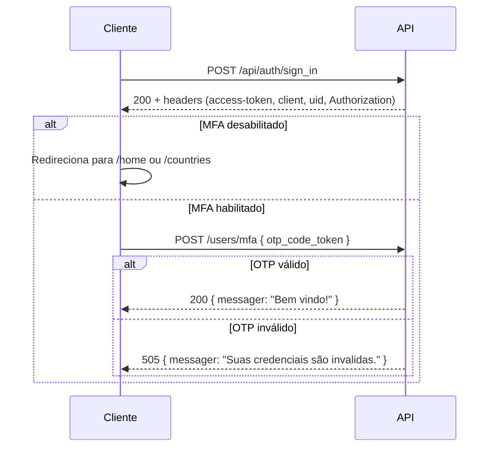

# Autenticação & Segurança

Este documento descreve os fluxos de autenticação implementados e ressalvas conhecidas entre o comportamento real e boas práticas de segurança.

---

## Stack de autenticação

| Componente | Uso |
|------------|-----|
| **Devise** | Registro, lockable, timeoutable, trackable, validatable |
| **DeviseTokenAuth** | Tokens Bearer em header `Authorization` |
| **devise-two-factor** + **active_model_otp** | TOTP (MFA) |
| **bcrypt** | Hash de senha |

Configuração principal: `api/config/initializers/devise.rb`, `devise_token_auth.rb`, model `User`.

---

## Fluxo de cadastro

1. `POST /api/auth` com e-mail e senha.
2. Validação de complexidade da senha **apenas no `:create`**:

```
6–32 caracteres, 1 minúscula, 1 maiúscula, 1 dígito, 1 caractere especial
```

3. Resposta inclui dados do usuário; tokens podem vir nos headers (DeviseTokenAuth).

---

## Fluxo de login



### Headers de sessão

Após login, o cliente deve persistir e reenviar:

- `Authorization` (Bearer)
- `access-token`, `client`, `uid`, `expiry`, `token-type` (quando aplicável)

`config.change_headers_on_each_request = false` — tokens estáveis entre requisições.

---

## Expiração e bloqueio

| Mecanismo | Configuração | Valor |
|-----------|--------------|-------|
| Timeout de sessão (Devise) | `config.timeout_in` | **5 minutos** |
| Tentativas antes do lock | `config.maximum_attempts` | **5** |
| Estratégia de lock | `lock_strategy` | `:failed_attempts` |
| Desbloqueio automático | `unlock_strategy` | `:failed_attempts` |
| Janela de unlock por tempo | `unlock_in` | 10 minutos |

Quando `failed_attempts` atinge o máximo, `UserMailer.login_attempt_notification` é disparado (`after_update` no model).

---

## MFA (TOTP)

### Ativar

1. `GET /api/myaccount/open_qrcode_mfa` → URL do PNG (ActiveStorage).
2. Usuário escaneia no app autenticador.
3. `POST /users/enable_multi_factor_authentication` com `otp_code_token` (drift: 60s).
4. `otp_module` passa para `enabled`.

### Desativar

`POST /users/disable_multi_factor_authentication` — **não exige OTP válido** na implementação atual. Qualquer usuário autenticado com o `id` correto desativa o MFA.

### Login com MFA

Após `sign_in`, se `otp_module_enabled?`, o cliente deve chamar `POST /users/mfa` antes de considerar a sessão completa. O frontend guarda flag `mfa` no `localStorage` durante esse fluxo.

---

## Recuperação de senha

1. `POST /password/forgot` → gera `reset_password_token` e envia e-mail.
2. `POST /password/reset` com `email`, `token`, `password`.
3. Token válido por **4 horas** (`User#password_token_valid?`).

> A validação de **formato de senha forte** do cadastro **não** está aplicada explicitamente em `reset_password!` — apenas validações padrão do Devise.

---

## Desbloqueio de conta

`GET /unlock/show?unlock_token=<valor>`

Implementação em `UnlockController`:

- Busca usuário por **e-mail** usando o valor de `unlock_token`.
- Chama `unlock_access!` sem validar um token criptográfico de desbloqueio.

**Risco:** quem conhecer o e-mail de um usuário bloqueado pode desbloquear a conta se souber a URL. Em produção, substituir por token único enviado por e-mail (padrão Devise `:unlockable`).

---

## Logout

| Camada | Comportamento |
|--------|---------------|
| API | `DELETE /api/auth/sign_out` (DeviseTokenAuth) |
| Frontend | `signout()` em `auth.js` **apenas remove** `authorization` do `localStorage` — não chama a API |

---

## Ressalvas e melhorias sugeridas

| Item | Situação atual | Recomendação |
|------|----------------|--------------|
| Desativar MFA | Sem verificação OTP | Exigir `otp_code_token` válido |
| Desbloqueio | E-mail no query param | Token aleatório único por e-mail |
| Senha no reset/update | Sem regex de complexidade | Reutilizar validação do cadastro |
| Logout no client | Só localStorage | Chamar `DELETE /api/auth/sign_out` |
| Status HTTP 505 no MFA | Não padrão | Usar `401` ou `422` |
| `SECRET_KEY_BASE` no Compose | Valor fixo no YAML | Variável de ambiente por ambiente |
| URLs da API no React | `localhost:3030` hardcoded | Usar `REACT_APP_API_URL` |

---

## Referência rápida de endpoints

Ver [endpoints.md](endpoints.md) para contratos JSON completos.
