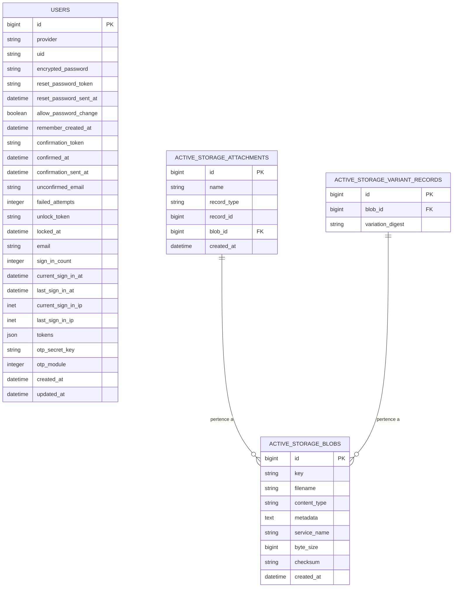

# Banco de Dados

## Tecnologia

**PostgreSQL** (versão estável), gerenciado via **ActiveRecord** (Rails 7).  
A extensão `plpgsql` é habilitada para suporte a funções procedurais.

---

## Diagrama ER



---

## Tabela `users`

Tabela central do sistema. Consolida os campos de múltiplos módulos Devise.

| Coluna | Tipo | Descrição |
|--------|------|-----------|
| `id` | bigint PK | Identificador único |
| `provider` | string | Provedor de autenticação (padrão: `"email"`) |
| `uid` | string | Identificador único no provedor |
| `encrypted_password` | string | Senha encriptada via bcrypt |
| `reset_password_token` | string | Token de redefinição de senha (hex 20 chars) |
| `reset_password_sent_at` | datetime | Data/hora de emissão do token |
| `allow_password_change` | boolean | Flag DeviseTokenAuth |
| `confirmation_token` | string | Token de confirmação de e-mail |
| `confirmed_at` | datetime | Confirmação de e-mail |
| `failed_attempts` | integer | Contador de tentativas de login falhas (padrão: 0) |
| `unlock_token` | string | Token para desbloqueio de conta |
| `locked_at` | datetime | Momento do bloqueio da conta |
| `sign_in_count` | integer | Total de logins realizados |
| `current_sign_in_ip` | inet | IP do login atual |
| `last_sign_in_ip` | inet | IP do login anterior |
| `tokens` | json | Tokens ativos de sessão (DeviseTokenAuth) |
| `otp_secret_key` | string | Segredo TOTP para MFA |
| `otp_module` | integer | Estado do MFA: `0 = disabled`, `1 = enabled` |

### Índices

| Índice | Coluna(s) | Único |
|--------|-----------|-------|
| `index_users_on_email` | `email` | sim |
| `index_users_on_uid_and_provider` | `uid, provider` | sim |
| `index_users_on_confirmation_token` | `confirmation_token` | sim |
| `index_users_on_reset_password_token` | `reset_password_token` | sim |

---

## Tabelas ActiveStorage

Usadas para armazenar temporariamente o QR Code PNG gerado para configuração do MFA.

| Tabela | Finalidade |
|--------|-----------|
| `active_storage_blobs` | Metadados e conteúdo do arquivo |
| `active_storage_attachments` | Polimórfica — liga blobs a qualquer model |
| `active_storage_variant_records` | Variantes transformadas de blobs |

---

## Migrações

| Versão | Arquivo | Descrição |
|--------|---------|-----------|
| `20230518142147` | `devise_create_users` | Criação da tabela `users` com todos os módulos Devise |
| `20230710193219` | `add_otp_secret_key_to_users` | Adiciona coluna `otp_secret_key` |
| `20230711001957` | `create_active_storage_tables` | Tabelas do ActiveStorage |

---

## Configuração de Conexão

Definida via variáveis de ambiente injetadas pelo Docker Compose:

```yaml
POSTGRES_USER: postgres
POSTGRES_PASSWORD: postgres
POSTGRES_HOST: db
```
