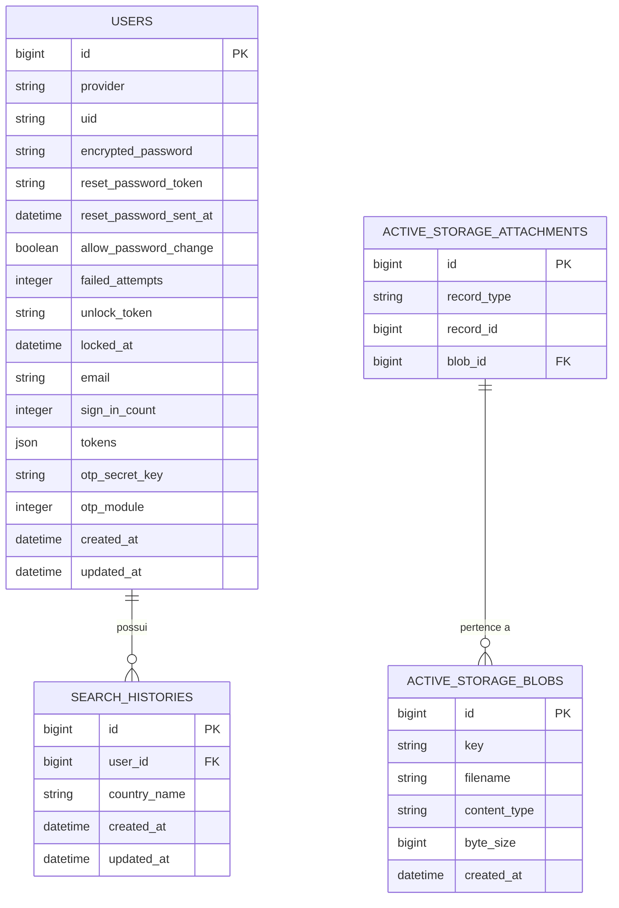

# Banco de Dados

## Tecnologia

**PostgreSQL**, gerenciado via **ActiveRecord** (Rails 7).  
Extensão `plpgsql` habilitada.

---

## Diagrama ER



---

## Tabela `users`

Tabela central. Campos dos módulos Devise + MFA.

| Coluna | Tipo | Descrição |
|--------|------|-----------|
| `id` | bigint PK | Identificador único |
| `provider` | string | Provedor (padrão: `"email"`) |
| `uid` | string | Identificador no provedor |
| `encrypted_password` | string | Senha bcrypt |
| `reset_password_token` | string | Token de reset (`SecureRandom.hex(10)`) |
| `reset_password_sent_at` | datetime | Emissão do token de reset |
| `allow_password_change` | boolean | Flag DeviseTokenAuth |
| `failed_attempts` | integer | Tentativas falhas (padrão: 0) |
| `unlock_token` | string | Token Devise (não usado pelo fluxo custom de unlock) |
| `locked_at` | datetime | Momento do bloqueio |
| `email` | string | E-mail único |
| `sign_in_count` | integer | Total de logins |
| `tokens` | json | Sessões ativas (DeviseTokenAuth) |
| `otp_secret_key` | string | Segredo TOTP |
| `otp_module` | integer | `0 = disabled`, `1 = enabled` |

### Índices

| Índice | Coluna(s) | Único |
|--------|-----------|-------|
| `index_users_on_email` | `email` | sim |
| `index_users_on_uid_and_provider` | `uid, provider` | sim |
| `index_users_on_confirmation_token` | `confirmation_token` | sim |
| `index_users_on_reset_password_token` | `reset_password_token` | sim |

---

## Tabela `search_histories`

Registra buscas de países por usuário autenticado.

| Coluna | Tipo | Descrição |
|--------|------|-----------|
| `id` | bigint PK | Identificador |
| `user_id` | bigint FK | Referência a `users` |
| `country_name` | string | Nome buscado (como enviado na requisição) |
| `created_at` | datetime | Data da busca |
| `updated_at` | datetime | Atualização do registro |

### Índices

| Índice | Coluna(s) |
|--------|-----------|
| `index_search_histories_on_user_id` | `user_id` |
| `index_search_histories_on_user_id_and_created_at` | `user_id, created_at` |

### Comportamento na API

- Criado automaticamente após busca bem-sucedida em `Countries::HistoryPersister`.
- Listagem (`GET /api/search_histories`): últimos 100 registros, deduplicados por `country_name` (case-insensitive), retorno limitado a **20** itens.

---

## Tabelas ActiveStorage

Armazenam temporariamente o PNG do QR Code para configuração MFA.

| Tabela | Finalidade |
|--------|-----------|
| `active_storage_blobs` | Metadados e conteúdo |
| `active_storage_attachments` | Ligação polimórfica blob ↔ model |
| `active_storage_variant_records` | Variantes de imagem |

---

## Migrações

| Versão | Arquivo | Descrição |
|--------|---------|-----------|
| `20230518142147` | `devise_create_users` | Tabela `users` com módulos Devise |
| `20230710193219` | `add_otp_secret_key_to_users` | Coluna `otp_secret_key` e `otp_module` |
| `20230711001957` | `create_active_storage_tables` | Tabelas ActiveStorage |
| `20230712000001` | `create_search_histories` | Tabela `search_histories` + FK para `users` |

---

## Configuração de Conexão

Variáveis injetadas pelo Docker Compose no serviço `api`:

```yaml
POSTGRES_USER: postgres
POSTGRES_PASSWORD: postgres
POSTGRES_HOST: db
```
