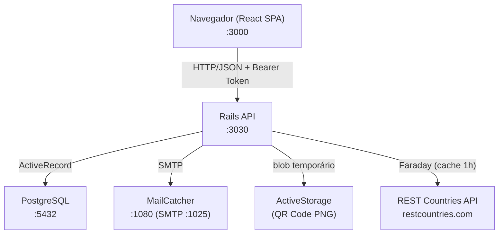
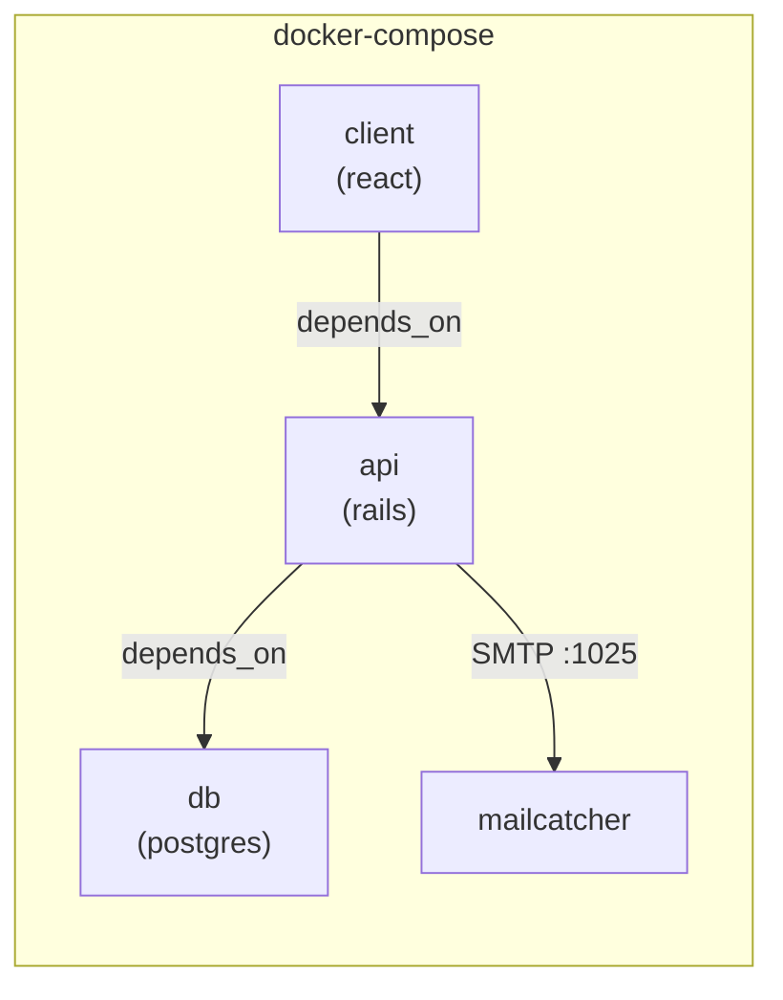

# Visão Geral da Arquitetura

## Estilo Arquitetural

O projeto adota uma arquitetura **cliente-servidor desacoplada** (SPA + REST API), onde:

- O **frontend React** gerencia interface e tokens no `localStorage`.
- O **backend Rails** expõe API JSON stateless com autenticação via Bearer Token (DeviseTokenAuth).
- O **PostgreSQL** persiste usuários e histórico de buscas.
- A **REST Countries API** fornece dados de países (com cache e timeout no backend).
- O **Docker Compose** orquestra todos os serviços.

---

## Diagrama de Componentes



---

## Diagrama de Implantação (Docker Compose)



| Serviço | Imagem | Porta exposta |
|---------|--------|---------------|
| `db` | `postgres` | 5432 |
| `api` | Dockerfile local (Ruby) | 3030 |
| `client` | Dockerfile local (Node) | 3000 |
| `mailcatcher` | `yappabe/mailcatcher` | 1025 (SMTP), 1080 (UI) |

> O serviço `api` sobe com `RAILS_ENV=production` no Compose local. Veja [getting-started.md](getting-started.md) para implicações.

---

## Camadas da Aplicação

### Backend (Rails API)

```
api/
├── app/
│   ├── controllers/
│   │   ├── api/v1/              # countries, search_histories, myaccount
│   │   ├── users/               # MFA e sessão pós-login
│   │   ├── password_controller.rb
│   │   └── unlock_controller.rb
│   ├── models/                  # User, SearchHistory
│   ├── services/
│   │   ├── countries/           # FetcherService, HttpClient, ResponseParser, HistoryPersister
│   │   └── qrcode_create_service.rb
│   └── mailers/                 # forgot password, lock notification, update password
├── config/
│   ├── routes.rb
│   └── initializers/            # Devise, DeviseTokenAuth, CORS
├── db/
│   ├── schema.rb
│   └── migrate/
└── lib/
    └── api_constraints.rb       # Versionamento via Accept header
```

#### Serviços `Countries::*`

| Classe | Responsabilidade |
|--------|------------------|
| `FetcherService` | Orquestra busca, cache (1h), persistência de histórico |
| `HttpClient` | Chamadas Faraday à REST Countries (timeout 5s, open 3s) |
| `ResponseParser` | Normaliza payload externo para hash da API |
| `HistoryPersister` | Grava `SearchHistory` após busca bem-sucedida |
| `Errors` | `NotFound`, `Timeout`, `ExternalApiError` |

### Frontend (React SPA)

```
client/src/
├── App.js
├── routes/index.js            # Rotas públicas e Private (auth guard)
├── operations/
│   ├── auth.js                # Login, MFA, senha, unlock
│   └── countries.js           # Busca e histórico
├── pages/
│   ├── Signin/, Signup/, Home/
│   ├── Countries/             # Country Explorer (feature principal pós-login)
│   ├── ForgotPassword/, UpdatePassword/, UnlockShow/
│   ├── MfaForLogin/
│   └── User/                  # Password, MfaSettings
└── components/
    ├── CountryCard/, SearchInput/, SearchHistoryList/
    ├── Navbar/, Sidebar/, Button/, Input/
```

---

## Versionamento da API

Rotas em `/api/*` usam `ApiConstraints` com header `Accept`:

- **v1 (padrão):** `application/country-explorer-api.v1` ou ausência de versão explícita (default)
- **v2:** namespace reservado, sem rotas implementadas

---

## Decisões de Design

| Decisão | Justificativa |
|---------|--------------|
| Rails em modo API | Responde somente JSON, sem views |
| DeviseTokenAuth | Tokens Bearer compatíveis com SPA |
| MFA via TOTP (RFC 6238) | Suporte a apps autenticadores |
| ActiveStorage para QR Code | URL temporária do blob para configuração MFA |
| Cache de países (1h) | Reduz chamadas à API externa |
| Histórico por usuário | Rastreia buscas recentes na UI |
| MailCatcher em dev | Captura e-mails sem SMTP real |
| Serviços injetáveis em `FetcherService` | Facilita testes com doubles (WebMock) |
