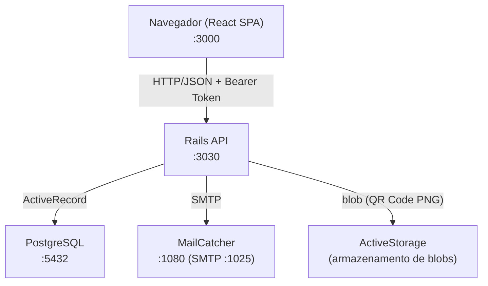
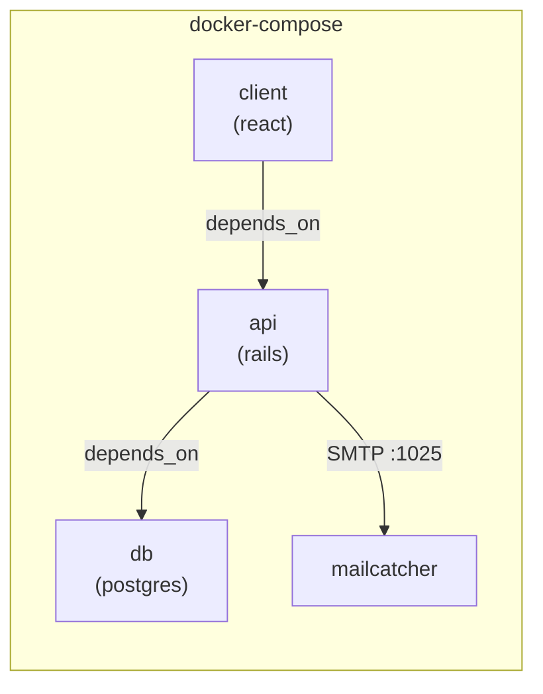

# Visão Geral da Arquitetura

## Estilo Arquitetural

O projeto adota uma arquitetura **cliente-servidor desacoplada** (SPA + REST API), onde:

- O **frontend React** é responsável pela interface e estado de sessão local.
- O **backend Rails** expõe uma API JSON stateless com autenticação via token.
- O **PostgreSQL** persiste todos os dados de usuário.
- O **Docker Compose** orquestra todos os serviços.

---

## Diagrama de Componentes



---

## Diagrama de Implantação (Docker Compose)



| Serviço | Imagem | Porta exposta |
|---------|--------|---------------|
| `db` | `postgres` | 5432 |
| `api` | Dockerfile local (Ruby) | 3030 |
| `client` | Dockerfile local (Node) | 3000 |
| `mailcatcher` | `yappabe/mailcatcher` | 1025 (SMTP), 1080 (UI) |

---

## Camadas da Aplicação

### Backend (Rails API)

```
api/
├── app/
│   ├── controllers/       # Controladores REST
│   │   ├── api/v1/        # Recursos versionados (namespace :api)
│   │   └── users/         # Ações Devise estendidas (MFA, Sessions)
│   ├── models/            # ActiveRecord + Devise modules
│   ├── services/          # Objetos de serviço (ex: QrcodeCreateService)
│   ├── mailers/           # ActionMailer (forgot password, lock notification)
│   └── serializers/       # ActiveModelSerializers (v0.10)
├── config/
│   ├── routes.rb          # Roteamento central
│   └── initializers/      # Devise, DeviseTokenAuth, CORS
├── db/
│   ├── schema.rb          # Estado atual do banco
│   └── migrate/           # Histórico de migrações
└── lib/
    └── api_constraints.rb # Roteamento por versão via Accept header
```

### Frontend (React SPA)

```
client/src/
├── App.js                 # Ponto de entrada, aplica rotas e estilos globais
├── routes/index.js        # Definição de rotas (react-router-dom v6)
├── operations/auth.js     # Todas as chamadas HTTP (axios)
├── pages/                 # Telas da aplicação
│   ├── Signin/
│   ├── Signup/
│   ├── Home/
│   ├── ForgotPassword/
│   ├── UpdatePassword/
│   ├── MfaForLogin/
│   ├── UnlockShow/
│   └── User/              # Password, MfaSettings
└── components/            # UI reutilizável (Button, Input, Navbar)
```

---

## Decisões de Design

| Decisão | Justificativa |
|---------|--------------|
| Rails em modo API | Elimina overhead de views/assets; responde somente JSON |
| DeviseTokenAuth | Autenticação stateless via Bearer Token, compatível com SPA |
| Versionamento de API via Accept header | Permite evolução da API sem quebrar clientes existentes |
| MFA via TOTP (RFC 6238) | Padrão amplamente suportado por apps autenticadores |
| ActiveStorage para QR Code | Gera URL temporária do blob sem persistência desnecessária |
| MailCatcher em dev | Captura e-mails sem envio real durante o desenvolvimento |
